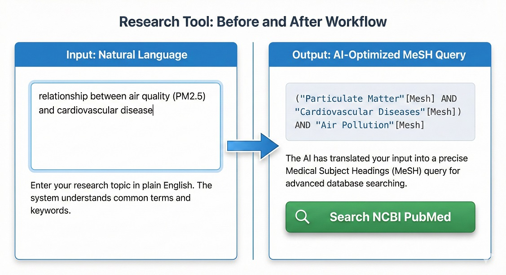

# AI-Powered PubMed Query Optimizer (MeSH)

### 🎯 Research Workflow Automation Tool

For environmental health researchers and spatial epidemiologists, constructing precise search queries for systematic reviews in PubMed can be time-consuming. This tool automates the process by translating natural language research topics into standardized **Medical Subject Headings (MeSH)** queries using Large Language Models (Llama 3 via Groq API).

---

## 📸 Preview: Workflow

This image illustrates how the tool translates a plain English research question into a complex, database-ready MeSH string.

*(Note: The output query is immediately ready for use on NCBI PubMed.)*

---

## ✨ Key Features

* **AI-Driven Translation:** Utilizes the `llama-3.3-70b-versatile` model to understand biomedical context.
* **MeSH Standardization:** Ensures output adheres to National Library of Medicine (NLM) tagging standards.
* **Research Efficiency:** Reduces the time spent on search strategy design.
* **Clean Interface:** Built with Bootstrap 5 for a modern user experience.

## 🛠️ Technologies

* **Backend:** PHP (cURL API handling)
* **AI Inference:** Groq Cloud API
* **Frontend:** HTML5, Bootstrap 5, JavaScript (AJAX)

## 🚀 Setup (How to run)

1.  Clone this repository to your local PHP server (e.g., XAMPP).
2.  Get a free API Key from Groq Cloud.
3.  Open `config.php` and replace `'YOUR_GROQ_API_KEY_HERE'` with your actual key.
4.  Open `index.php` in your browser.

---
*Developed for research automation purposes.*
